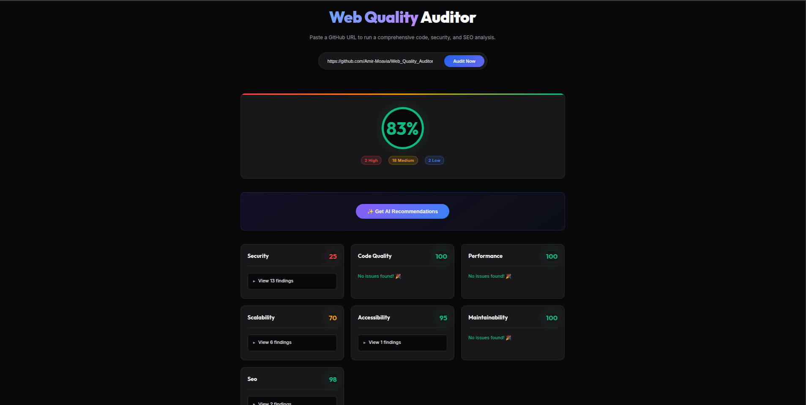
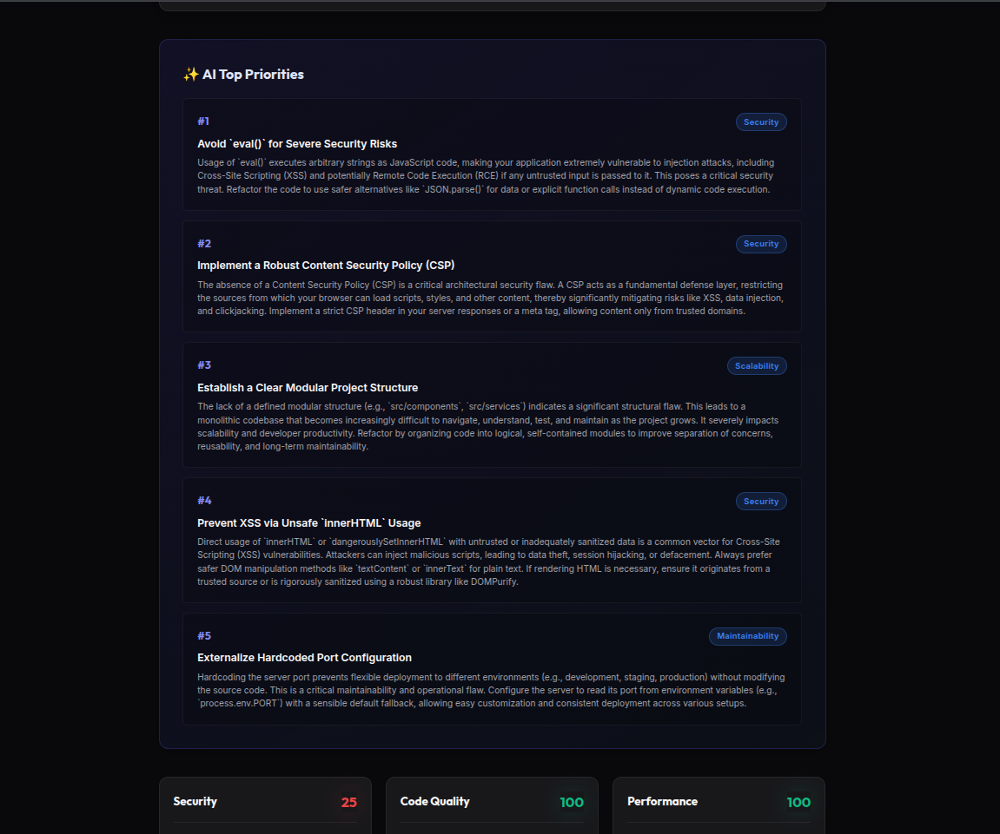

<div align="center">

# 🔍 Web Quality Auditor

**A comprehensive, AI-powered static analysis platform for auditing GitHub repositories.**

Paste any public GitHub URL → get an instant deep audit across 7 quality dimensions — powered by concurrent analysis pipelines and Google Gemini AI.

[](https://nodejs.org/)
[](https://expressjs.com/)
[](https://ai.google.dev/)
[](LICENSE)

</div>

---

<div align="center">

### 📸 Demo



*Analyzing a GitHub repository — showing overall score, severity breakdown, and category-level findings*

<br>



*Gemini AI identifies and ranks the top 5 most critical issues to fix first*

</div>

---

## ✨ Features

| Feature | Description |
|---------|-------------|
| **7 Concurrent Analyzers** | Runs Code Quality, Security, Performance, Accessibility, SEO, Maintainability & Scalability checks in parallel |
| **AI-Powered Priorities** | Google Gemini 2.5 Flash identifies and ranks the top 5 most critical issues to fix first |
| **Dependency Vulnerability Scan** | Automatically runs `npm audit` on cloned repositories to detect known CVEs in dependencies |
| **TypeScript Support** | Full linting support for `.ts` and `.tsx` files via `@typescript-eslint/parser` |
| **Hardened & Secure** | 60s global timeouts, 200MB/5000-file repo limits, IP-based rate limiting, and `execFile` (no shell injection) |
| **Zero-Framework Frontend** | Pure vanilla HTML/CSS/JS — no build step, no bundler, XSS-safe DOM rendering via `textContent`/`createElement` |
| **Smart Caching** | Normalized URL cache keys prevent redundant cloning of the same repository |

---

## 🏗️ Architecture

```
Web_Quality_Auditor/
├── backend/                    # Node.js/Express API server
│   ├── server.js               # Main entry point & route handler
│   ├── package.json
│   ├── .env.example            # Environment variable template
│   ├── scripts/                # Utility & test scripts
│   └── src/
│       ├── analyzers/          # 7 independent analysis modules
│       │   ├── codeQuality.js      # Programmatic ESLint (JS + TS)
│       │   ├── security.js         # Secret detection, XSS, CSP, npm audit
│       │   ├── performance.js      # Asset sizes, image optimization, lazy loading
│       │   ├── accessibility.js    # WCAG audits via Cheerio
│       │   ├── seo.js              # Meta tags, heading structure, Open Graph
│       │   ├── maintainability.js  # Cyclomatic complexity, nesting depth, duplication
│       │   └── scalability.js      # Structural & architectural heuristics
│       └── services/
│           ├── repoService.js      # Git clone, validation & size limits
│           ├── scoreAggregator.js  # Weighted scoring engine
│           └── aiSuggestions.js    # Gemini AI integration
│
└── frontend/                   # Vanilla HTML/CSS/JS dashboard
    ├── index.html
    ├── style.css               # Dark-mode UI with glassmorphism
    └── script.js               # Fetch-based API client & DOM rendering
```

---

## 🔬 Analyzer Breakdown

| # | Analyzer | What It Checks | Severity Mapping |
|---|----------|---------------|-----------------|
| 1 | **Code Quality** | ESLint `recommended` rules + `@typescript-eslint/recommended` for TS files | Errors → High, Warnings → Medium |
| 2 | **Security** | `eval()`, `innerHTML`, hardcoded secrets, insecure HTTP, missing CSP, unignored `.env` files, `npm audit` vulnerabilities | Critical/High CVEs → High |
| 3 | **Performance** | Images > 500KB, JS/CSS bundles > 1MB, missing `loading="lazy"` on `` tags | Large images > 1MB → High |
| 4 | **Accessibility** | Missing `alt` attributes, missing form labels, missing `lang` attribute, color contrast issues | Missing alt → Medium |
| 5 | **SEO** | Missing `<title>`, `<meta description>`, `<h1>`, Open Graph tags, canonical links | Missing title → High |
| 6 | **Maintainability** | Cyclomatic complexity > 10, functions > 50 lines, nesting depth > 4, code duplication via `jscpd` | High complexity → Medium |
| 7 | **Scalability** | Monolithic file detection, missing modularization, architectural anti-patterns | Large monoliths → Medium |

### Scoring Formula

Each category starts at **100** and deducts points based on findings:

```
penalty = ((high × 10) + (medium × 5) + (low × 1)) / normalizationFactor
score = max(0, 100 - penalty)
```

The **overall score** is a weighted average across all 7 categories (15% each for the first 6, 10% for SEO).

---

## 🚀 Getting Started

### Prerequisites

- **Node.js** 18+ and **npm**
- **Git** (for cloning repositories)
- **Python 3** (for serving the frontend) — or any static file server
- **Google Gemini API Key** ([Get one here](https://aistudio.google.com/apikey)) — *optional, only needed for AI recommendations*

### 1. Clone the Repository

```bash
git clone https://github.com/Amir-Moavia/Web_Quality_Auditor.git
cd Web_Quality_Auditor
```

### 2. Setup the Backend

```bash
cd backend
npm install
```

Create a `.env` file (or export the variable) with your Gemini API key:

```bash
# Option A: Environment variable (recommended for dev)
export GEMINI_API_KEY=your_api_key_here

# Option B: Create a .env file
echo "GEMINI_API_KEY=your_api_key_here" > .env
```

Start the development server:

```bash
npm run dev
# ✅ [SERVER] Backend running on http://localhost:4000
```

### 3. Serve the Frontend

Open a **new terminal**:

```bash
cd frontend
python3 -m http.server 3000
# ✅ Serving on http://localhost:3000
```

### 4. Use the App

Open **http://localhost:3000** in your browser, paste a public GitHub URL, and click **"Audit Now"**.

---

## 🔒 Security & Safety

This tool clones and statically analyzes arbitrary code from the internet. The following safeguards are in place:

- **Read-Only Scanning** — Cloned code is never executed; only parsed via AST/regex/DOM
- **No Shell Injection** — All subprocess calls use `execFile` with argument arrays (no string interpolation)
- **Auto-Cleanup** — Temp directories are force-deleted in a `finally` block after every analysis
- **Repo Size Limits** — Repositories exceeding 200MB or 5,000 files are rejected before analysis
- **Global Timeout** — The entire pipeline is wrapped in a 60-second `Promise.race` timeout
- **Rate Limiting** — IP-based request throttling via `express-rate-limit`
- **XSS-Safe Frontend** — All dynamic content rendered via `textContent`/`createElement`, never `innerHTML` with user data

---

## 🛠️ Tech Stack

| Layer | Technology |
|-------|-----------|
| **Backend Runtime** | Node.js 18+ |
| **API Framework** | Express 4.x |
| **Code Linting** | ESLint 8 + @typescript-eslint/parser |
| **HTML/DOM Parsing** | Cheerio |
| **Complexity Analysis** | typhonjs-escomplex |
| **Duplication Detection** | jscpd |
| **Git Operations** | simple-git |
| **AI Integration** | Google Generative AI SDK (Gemini 2.5 Flash) |
| **Frontend** | Vanilla HTML5, CSS3, JavaScript (ES2021) |
| **Typography** | Google Fonts (Inter + Outfit) |

---

## 📝 API Reference

### Health Check

```
GET /api/health
→ { "status": "ok" }
```

### Analyze Repository

```
POST /api/analyze
Content-Type: application/json

{ "repoUrl": "https://github.com/user/repo" }

# With AI recommendations:
POST /api/analyze?withAI=true
```

**Response:**

```json
{
  "status": "analyzed",
  "overallScore": 72.5,
  "issueSummary": { "high": 3, "medium": 12, "low": 8 },
  "categories": {
    "security": { "score": 65, "findings": [...] },
    "codeQuality": { "score": 80, "findings": [...] },
    "performance": { "score": 95, "findings": [...] },
    ...
  },
  "aiSuggestions": [
    { "title": "...", "explanation": "...", "category": "Security" }
  ]
}
```

---

## 🤝 Contributing

Contributions are welcome! Feel free to open an issue or submit a pull request.

1. Fork the repository
2. Create your feature branch (`git checkout -b feature/amazing-feature`)
3. Commit your changes (`git commit -m 'feat: add amazing feature'`)
4. Push to the branch (`git push origin feature/amazing-feature`)
5. Open a Pull Request

---

## 📄 License

This project is open source and available under the [MIT License](LICENSE).

---

<div align="center">

**Built with ❤️ by [Amir Moavia](https://github.com/Amir-Moavia)**

</div>
